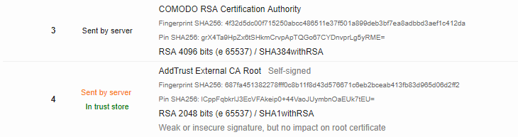
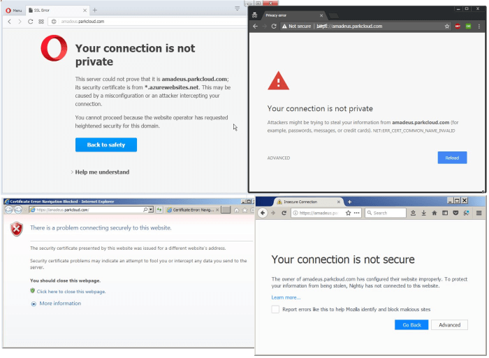
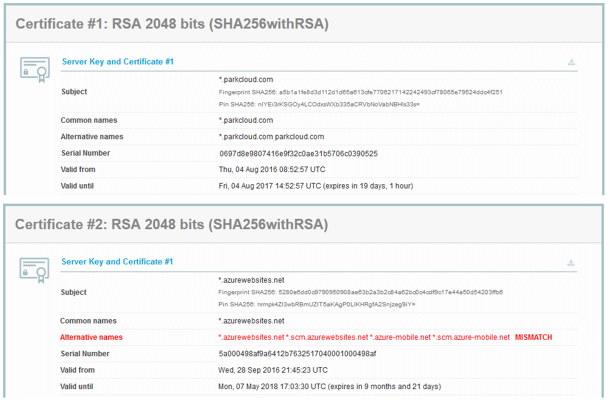
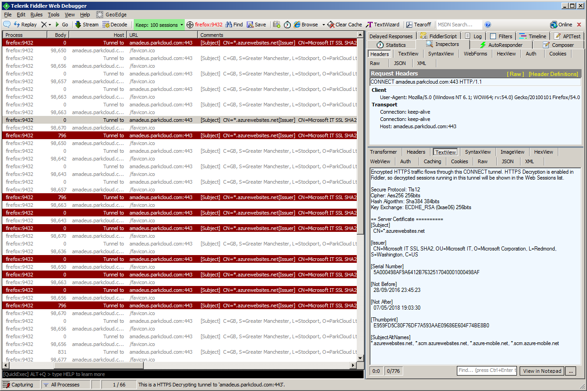
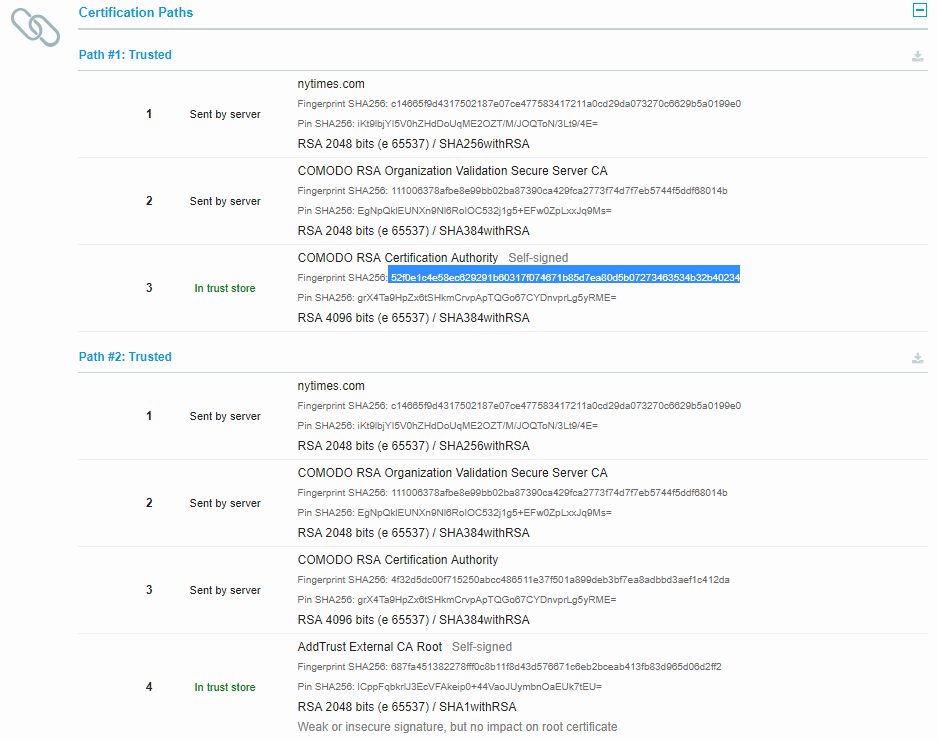
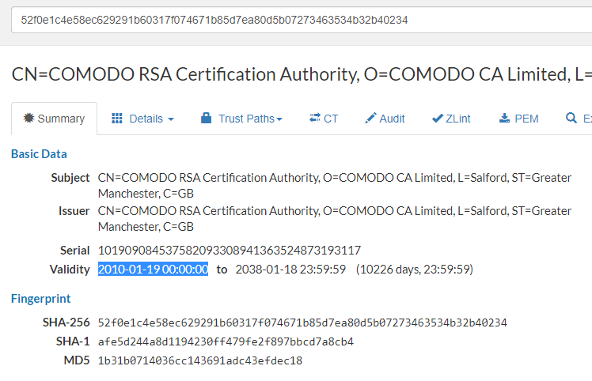

Real-world HTTPS deployment pitfalls (part 2)
============================================

_This is part 2 of the blog post.
For part 1, see [here](https://gitlab.com/jakub-g/blog-wip-public/blob/master/https-pitfalls/https-pitfalls.md),
where I discuss: how not to overlook an expiring cert; how not to shoot yourself in foot with HSTS; a case of forgotten "nowww";
why you should always send intermediate certificates; and TLS 1.2 migration considerations if you support Android KitKat._

Extraneous certificates
=======================

_TL;DR: Save yourself some bandwidth, and improve initial render time, by not sending root certificate from the server._

This is technically not a huge problem, but extraneous certificates bloat each new TLS connection,
and are an equivalent of sending unoptimized JPEGs full of metadata.

Since a TLS handshake is the very first thing happening when connecting to a domain over HTTPS,
by sending unnecessary data at this stage, you may slightly increase initial render time for users with poor connections.

**Every compliant browser will ignore a self-signed root cert at the end of the chain:**
if the browser has that root cert in its store, the TLS validation will succeed,
and if it doesn't, it will fail.
Contrary to intermediate certs, which for robustness should always be sent,
there's no point of sending the root cert.

Serving multiple certificates, one of which is wrong
====================================================

This is a strange case of server misconfiguration, but I discovered it happening
recently to one of our partners.

Initially it seemed like things worked correctly most of the time, but sometimes,
regardless of the browser and operating system (Windows, iOS, Android), the TLS connection would fail.

When checked in SSL Labs, it showed two different certificates returned by the server:

But *what does it mean that the server returns two certificates*?
How is this technically possible? Is the problem on the browser side or server
side?

I was confused by that, so I reached to Ivan Ristić from SSL Labs who explained (thanks!)
that SSL Labs does multiple connections during the test, and collects all the
server certs it encounters. The server _can only return one **server certificate**
at a time_ (though it may return a different one on each connection attempt) --
and in addition, it may return a "bag of certs" containing intermediate certs,
to help the client to perform the validation of the chain of trust.

To inspect the issue more closely, I enabled Fiddler, configured it temporarily to ignore certificate
errors, and put a few lines of Fiddler script to log the details of the certificate
in the "comments" column, and highlight it in the session list if the observed cert was wrong.

      static function onEvalCert(o: Object, e: ValidateServerCertificateEventArgs)
      {
        try
        {
          var X2: System.Security.Cryptography.X509Certificates.X509Certificate2 =
            new System.Security.Cryptography.X509Certificates.X509Certificate2(e.ServerCertificate);

          if( X2.ToString().Contains("azure") ) {
            e.Session["ui-backcolor"] = "darkred";
            e.Session["ui-color"] = "white";
          }
          e.Session["ui-Comments"] = X2.ToString();
          e.Session.RefreshUI();
        }
        catch (ex)
        {
          FiddlerApplication.Log.LogFormat("Failed to evaluate certificate: {0}", ex.Message);
        }
      }

      static function OnBoot() {
        FiddlerApplication.add_OnValidateServerCertificate(onEvalCert);
      }

Then I opened `/favicon.ico` URL of the server in the browser, and hit `F5` a number of times.

After this test, I realized that in fact the TLS connection failed
almost randomly with 50-50 chance, as you can see in the screenshot below:

It turned out the Azure deployment of our partner was misconfigured and the server
was sometimes wrongly sending a server certificate of Azure, instead of that of the appropriate customer domain
(unfortunately, I don't know more details of what kind of misconfiguration it was).

Serving certificate signed only by a niche or a very new root cert
==================================================================

This is something that most likely won't affect you if you obtain your certificates from any  major CA, but I decided to put it here for completeness, as I learned about it while investigating an issue of incomplete chain mentioned earlier.

All the browsers and operating systems have *loads* of root certs in their stores, *but those stores are not equal.* **Depending on the OS, browser, device vendor, and even country when the device is sold, there might be slight variations in cert store contents.** (You might want to double check that topic if you do a truly worldwide business and target Asian markets for example.)

There's also variation in time: **a device with an operating system from 2009 most likely will not have a root cert issued in 2010!**

Typically the leaf certs are short-lived (months/years), and root certs are long-lived (years/decades), but the issue still holds. **If you need to support very old Windows or Android**, double check that your cert has been signed with an old enough cert (typically the CAs will do it for you - if they use a very new cert, they will also cross-sign using an older cert).

How can you verify cert's details? The easiest way is to obtain its fingerprint (hash)...

...and then use it in your favorite search engine, which will lead you to a [Censys cert viewer](https://www.censys.io/certificates/52f0e1c4e58ec629291b60317f074671b85d7ea80d5b07273463534b32b40234):

The example above is a popular Comodo cert issued in 2010. (Note this does not mean
it was immediately picked up by the browser vendors on day one after issuance).
**This particular cert is known to not be present in Android < 5.1.**, nor in Firefox < 36.
However, when Comodo signs your certs with that cert, it also cross-signs it (at least for now)
with an older cert that is available on older devices, so generally you don't have to worry about it.

Assumming your once-configured HTTPS will work forever
=======================================================

HTTPS is a moving target. Vulnerabilities in crypto algorithms and implementations are
found each year as the research and hardware advance, and hence you will need to reconfigure
your server periodically to avoid using deprecated crypto.

On the other hand, [various CAs have been compromised in the past](https://www.chromium.org/Home/chromium-security/root-ca-policy),
and in response, browser vendors changed the treatment of the certs issued by those CAs
(either lowering or fully revoking trust in those CAs); upcoming version of Chrome [will stop trusting certain old Symantec-issued certificates](https://groups.google.com/a/chromium.org/d/msg/blink-dev/eUAKwjihhBs/El1mH8S6AwAJ) way before their original expiration date.
 Also, there were
[software bugs related to handling of misbehaving CAs](https://www.chromium.org/developers/androidwebview/webview-ct-bug)
which made HTTPS connections wrongly fail if the site was using a Symantec-issued cert.

Keep yourself up-to-date with the news (you may want to follow [@sleevi_](https://twitter.com/sleevi_) on Twitter).
Avoid using certificates from certificate authorities that have a long track of misbehaviors and not following best industry practices - or at least be more vigilant in such case.

**Keep in mind that each HTTPS cert renewal is a potentially breaking change, and treat it as such - put the QA in the loop for a quick sanity.**

Use Chrome Canary and Firefox Nightly to learn about breaking changes before they reach the wider audience.

Additional Resources
====================

Tools
------

- [SSL Labs - HTTPS server config linter](https://www.ssllabs.com/ssltest/analyze.html?d=github.com)
- [SecurityHeaders.io - HTTP security headers linter](https://securityheaders.io/?q=https%3A%2F%2Fgithub.com%2F)
- [Mozilla observatory - another HTTP(S) linter](https://observatory.mozilla.org/analyze.html?host=github.com)
- [Certificate Transparency Tool from Facebook (blog post)](https://www.facebook.com/notes/protect-the-graph/introducing-our-certificate-transparency-monitoring-tool/1811919779048165/)
- [Certificate Monitor - email notifications for expirating certs](https://certificatemonitor.org/)
- [BadSSL - page for testing browser behavior on misconfigured HTTPS pages](https://badssl.com/)

Blogs
-----

- [HTTPS-related posts on a blog of Eric Lawrence](https://textslashplain.com/tag/https/)
- [Blog of Scott Helme](https://scotthelme.co.uk/)

Other
-----

- [Chromium Root Certificate Policy](https://www.chromium.org/Home/chromium-security/root-ca-policy)
- [TLS answers on Security.StackExchange](https://security.stackexchange.com/questions/tagged/tls?sort=votes&pageSize=15)
- [Content-Security-Policy](https://developer.mozilla.org/en-US/docs/Web/HTTP/Headers/Content-Security-Policy)
- [Content-Security-Policy: upgrade-insecure-requests](https://developer.mozilla.org/en-US/docs/Web/HTTP/Headers/Content-Security-Policy/upgrade-insecure-requests)