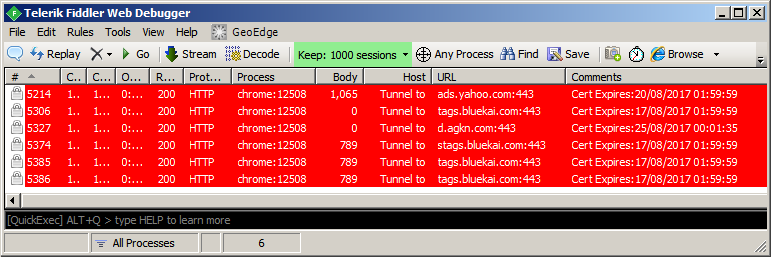
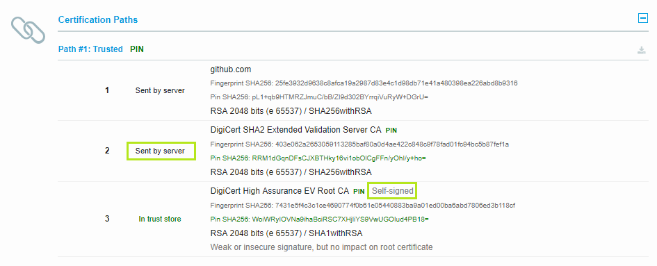
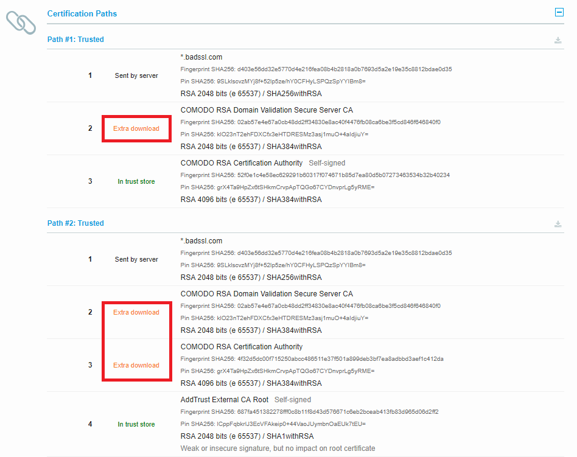
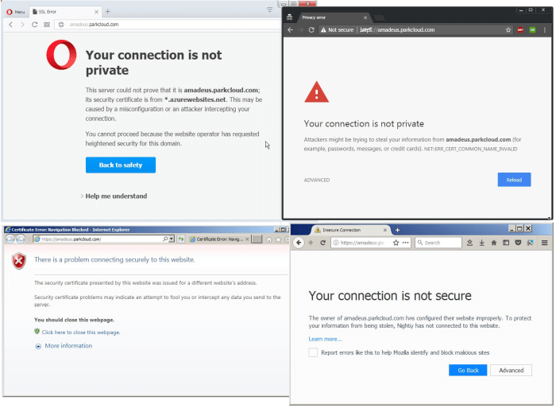
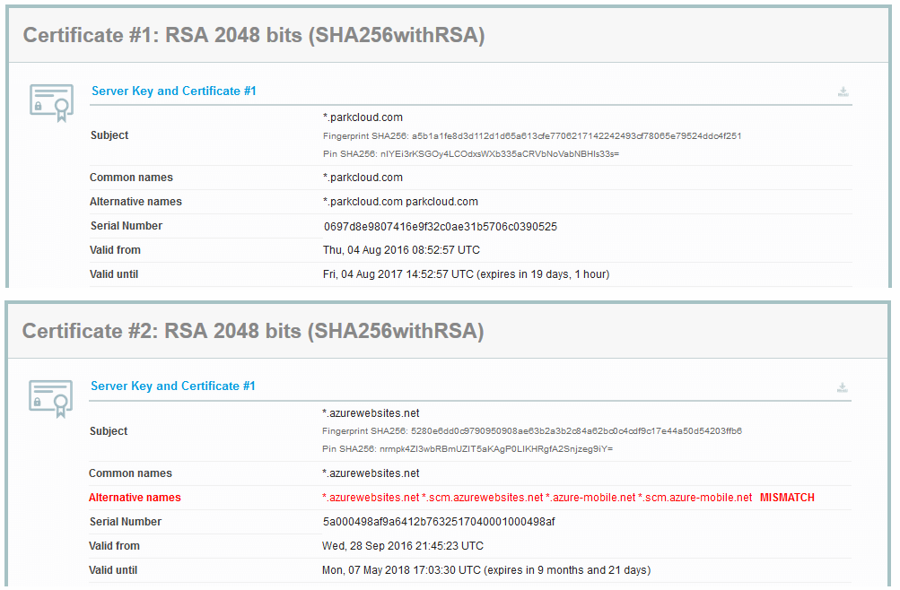
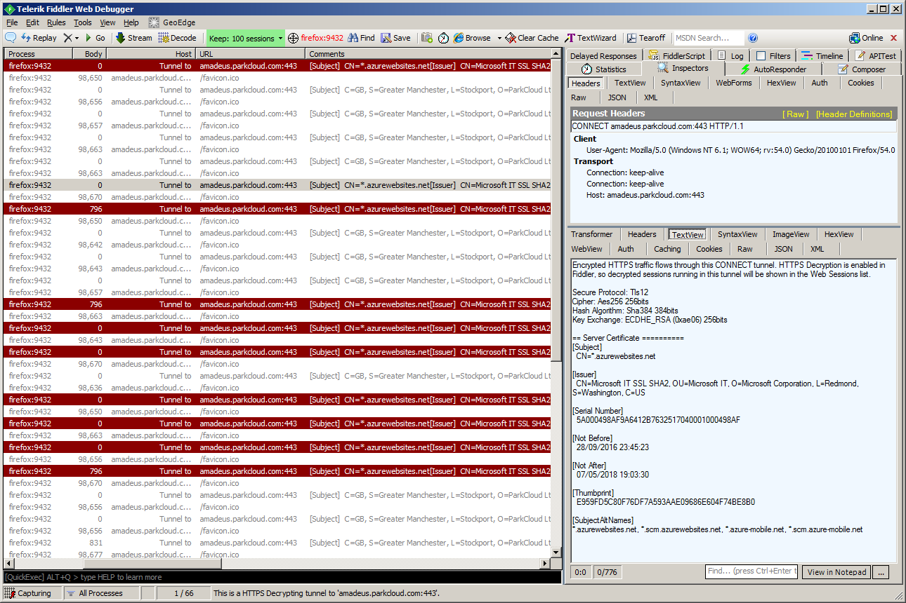
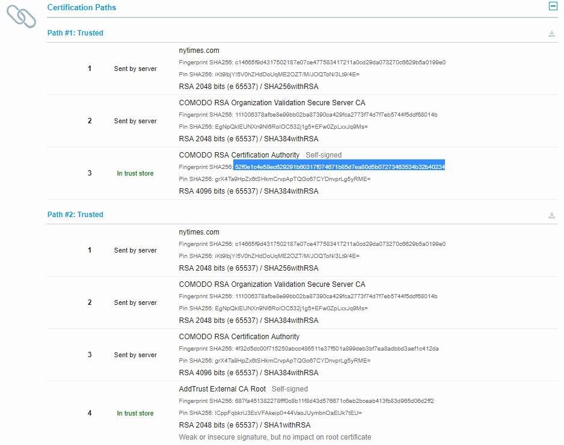
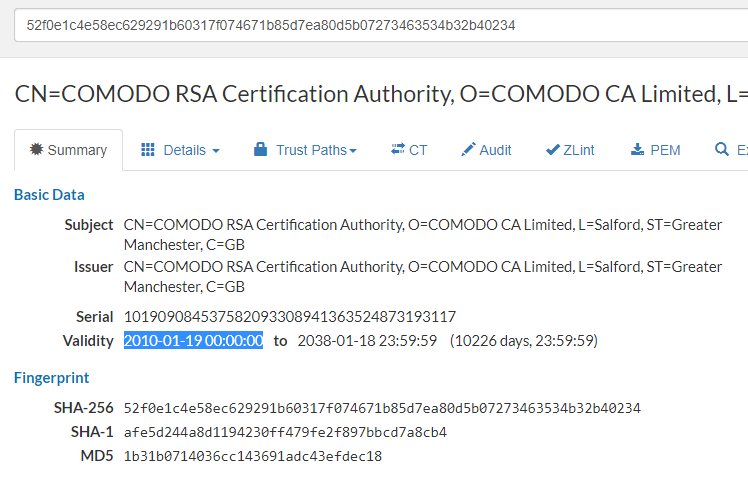

Real-world HTTPS deployment pitfalls
====================================

...or one year from life of a web/app developer, seeing broken HTTPS in the wild

All the things written below actually happened to my team, other teams at my company, or our external partners!

-------

*Who is this post for:* web & app developers, devops, sysadmins

*Technical difficulty:* low / intermediate (you know what is HTTPS, a CA, a certificate)

***TL;DR: if you have only 2 minutes now, go to [SSL Labs](https://www.ssllabs.com/ssltest/) and check your domain.
If you see anything in red or orange, compare your results with major websites like Google, GitHub, Microsoft, Guardian etc.
If the given problem is not present on any major site, but only on yours, it probably means you need to fix it NOW.***

Introductory Q&A
==================

_"I'm a just a developer and HTTPS is a devops things, do I really need to read all of that?"_

If you're a dev in a company migrating to HTTPS soon,
or your newly created project will be using HTTPS, _this post is for you_.
Even if your website is already in production, you may learn a thing or two.

Your devops will put things in place, and stuff will _mostly work_,
but they might not know all the arcane details of all web browsers,
and all requirements for your product, and then it will be _you_
who will have to debug stuff. So at least glance over the headlines and TL;DRs to get yourself familiar with common issues.

_"We have a staging environment, we'll catch everything before long deploying to prod!"_

**Only as long as 1) your staging env has exactly the same HTTPS cert and
config as production** (in big companies, it might not be the case, due to domain name differences and internal
policies), and 2) you **test all possible browsers and operating systems**
(but it may still not be enough!)

_"Is it really that hard?"_

If you don't want to break things for the end-users, it takes time.
Have a look for example at [this blog from The Guardian](https://www.theguardian.com/info/developer-blog/2016/nov/29/the-guardian-has-moved-to-https).

I will try not to repeat too many obvious things in this guide. I assume you already know
basic stuff about HTTPS from different sources.
**Instead I will point some things that might be easily overlooked, or not noticed at all
if you're (un)lucky - until you have an urgent issue in production.**.

Forgetting about certificate expiration
=======================================

*TL;DR: don't rely only on a once-a-year email reminder*

I temporarily break my promise and start from the most trivial yet costly mistake, similar to forgetting to renew a domain, but it happens nonetheless. At least every few weeks I stumble upon a high profile page with expired cert, or a near-miss.

Obviously you should have a well-defined process, with email reminder and someone responsible for taking the action, but...

Apart from that, **if you use Fiddler regularly, you can use [a few lines of FiddlerScript](
https://gist.github.com/ericlaw1979/678ed408075da213f742) to highlight HTTPS sessions that are using soon-expiring certs** *(thanks to Eric Lawrence for publishing it!)*, so that the expiration catches your attention before it's too late. You may want to customize it to only highlight sessions touching particular domain names of your interest:

        if (e.Session.hostname.EndsWith("mydomain.net") ||
            e.Session.hostname.EndsWith("mydomain.com")) {
          e.Session["ui-backcolor"] = "red";
          e.Session["ui-color"] = "white";
        }

Don't wait to renew the certificate on the last possible day (in particular when it expires on Sunday!) to avoid putting unnecessary stress on your team.

Using HSTS too aggressively
===========================

*TL;DR: only roll out HSTS when everything else's been checked and working well. Serve small `max-age` initially and increase as you gain confidence - or prepare to serve `max-age=0` in case of problems.*

[HSTS](https://developer.mozilla.org/en-US/docs/Web/HTTP/Headers/Strict-Transport-Security) is a very useful security header which tells the browser to "remember" to always load all URLs from a given domain over HTTPS, even if HTTP URLs are encountered, for a given period of time described by `max-age` field in the header value. In other words, it prevents you from visiting unsecured HTTP pages.

**Usually this is good, but obviously not when HTTPS version is not working properly,** and the user really wants to see the HTTP version.

_Story time:_ We have an on-site JIRA instance in my company; put in place several years ago over HTTP, but work began lately on serving JIRA and everything else over HTTPS.

At some point, the implementation team enabled an http->https redirect and an HSTS header. For some reason though, it turned out some parts of the page were not working over https (not that obvious to diagnose for the end user), so the force-https config was disabled, and the recommendation from JIRA support team was to use http URLs.

But, with HSTS it is not that easy: if you ever visited https version before, when visiting http URL later, you were redirected back to https page (the whole point of HSTS after all!), and  clearing standard browsing data didn't help.

**There are two solutions if your users get trapped by that problem:**

- You could serve `max-age=0` value for HSTS header which tells the browser to discard all HSTS data it has for the serving domain *(but this is taken into account by the browser only when served over HTTPS - as any other HSTS header value)*.
- Users may clear HSTS cache of the browser. Not very easy to do, and not user friendly; typically hidden in browser internals, for example: `chrome://net-internals/#hsts` in Chrome.

**Obviously, the best solution is to be cautious and only implement HSTS when everything else was verified; also, put a small `max-age` (a few hours, a few days) first, and gradually increase when no problems are found.**

Read more:

- [Blog post on HSTS on Qualys Blog](https://blog.qualys.com/securitylabs/2016/03/28/the-importance-of-a-proper-http-strict-transport-security-implementation-on-your-web-server)

Forgetting about www/nowww when deploying HTTPS, CDN, or security proxy
======================================================================

*TL;DR: do not forget about nowww. Make sure it works over http and redirects to https.*

Typically, your website has a canonical URL of `www.example.com` or `example.com`, so you have 2 entry points. Most likely you serve a redirect from one to the other, to avoid duplicated content.

However with HTTPS in the game, each of the two is accessible either via http or https, _so you have 4 entry points total_.

If you forget about your nowww domain, you might end up in the following situation:

1. User types "example.com" in URL bar
2. The server responds with a redirect to "https://example.com"
3. Your HTTPS cert is not valid for nowww domain -> **scary warning, user runs away.**

Another thing that could happen is that your traffic to nowww domain won't be resolved at all and user will think that your page is down.

The problem is so prevalent that modern browsers have some built-in magic to probe www domain in case of nowww not working, but as with any error recovery mechanism, it's better to not rely on it.

Actions:

1) **Make sure to choose one canonical entry point** (say, `https://www.example.com`) and put redirects in place in your webserver's config for the 3 remaining ones:

- http://www.example.com -> https://www.example.com
- http://example.com -> https://www.example.com
- https://example.com -> https://www.example.com

(You might want to write a simple bot that checks all of this each night and alerts you if a redirection stops working. Subsequent configuration changes, perhaps done by external teams -- not unheard of in corporate environments -- might break that redirection without anyone noticing.)

2) Since `example.com` and `www.example.com` are different origins, a regular TLS cert with just one explicit domain name won't work for both. **You need a cert with SAN (Subject Alternative Name) matching both, for example: `*.example.com example.com` or `www.example.com example.com`**

3) SEO tip: Generate `<link rel="canonical" href="https://...">` in the `<head>` of your HTML responses to make deduplication work easier for web crawlers.

See also the following support entries from Google Webmasters:

- [Google Webmasters guidelines: canonical URLs](https://support.google.com/webmasters/answer/139066?hl=en)
- [Google Webmasters guidelines: preferred domain](https://support.google.com/webmasters/answer/44231?hl=en)

Missing intermediate certificates
=================================

_TL;DR: run [SSL Labs](https://www.ssllabs.com/) check on your domain and if you see "Extra download" in certification path, **go now and fix it** and come back when done!_

First, quick primer on how CA (Certificate Authority) system works. Let's use GitHub as an example.

In the image below you see a certificate chain for github.com. There are 3 certs in play:

1. Server cert (leaf): This is GitHub's public cert that they use to secure the TLS session with the user's browser.
2. Intermediate cert of DigiCert, a Certificate Authority which signed (i.e. verified the authenticity) of the cert from GitHub (cert #1).
3. Root cert (high-trust cert) of DigiCert, which signed (i.e. verified the authencity) of the other cert from DigiCert (cert #2). This cert, like all the root certs, is self-signed by the issuer; all the root certs are self-signed by definition.

Browsers typically have *dozens and dozens* of root certs in the store, embedded in their installation, or in the operating system. Server certificates are typically not signed by root certs directly, but instead they're signed by *intermediate certs*. Anything in the chain between leaf cert (yourdomain.com) and the root cert is an intermediate cert. In a typical situation, there are 1 or 2 intermediate certs.

To verify the website's cert, the browser needs to have *a full chain of certification*, to verify trust of each link of the chain. The leaf cert is always sent by the server, the root certs are available in the browser, but where does the browser get the intermediate certificates from? There are two options:

1. either server sends all the intermediate certs,
2. or the browser needs to get them from *somewhere*.

The screenshot above shows GitHub properly sending the intermediate cert. **But what happens in the second case? It's implementation-specific, depends on the browser and platform:**

- if the browser happens to have an intermediate cert cached locally, because some other website that the user has visited served it, it will be reused;
- if the intermediate cert is not cached, some browsers will fetch it, but some won't; **in particular, Android WebView and all versions of Firefox do not fetch any missing certs!**

See an example of a misconfigured server below:

This servers's cert can be verified via two certification paths (because the intermediary cert has been cross-signed by two different certs), but unfortunately none of paths can be reliably resolved by the browser without an extra download.

**If you see "extra download" in SSL Labs, go now and fix it!** Your page might be randomly not working for many of your users (but it might be sporadic enough that you don't get any reports).

See also:

- [AIA fetching of missing intermediate certs](https://www.thesslstore.com/blog/aia-fetching/)
- [Firefox bug: Fetch missing intermediate certs](https://bugzilla.mozilla.org/show_bug.cgi?id=399324)

Extraneous certificates
=======================

_TL;DR: Save yourself some bandwidth, and improve initial render time, by not sending root certificate from the server._

This is technically not a huge problem, but extraneous certificates bloat each new TLS connection,
and are an equivalent of sending unoptimized JPEGs full of metadata.

Since a TLS handshake is the very first thing happening when connecting to a domain over HTTPS,
by sending unnecessary data at this stage, you slightly increase time to first paint for each user.

**Every compliant browser will ignore a self-signed root cert at the end of the chain:**
if the browser has that root cert in its store, the TLS validation will succeed,
and if it doesn't, it will fail.
Contrary to intermediate certs, which for robustness should always be sent,
there's no point of sending the root cert.

Serving multiple certificates, one of which is wrong
====================================================

This is a strange case of server misconfiguration, but I discovered it happening
recently to one of our partners.

Initially it seemed like things worked correctly most of the time, but sometimes,
regardless of the browser and operating system (Windows, iOS, Android), the TLS connection would fail.

When checked in SSL Labs, it showed two different certificates returned by the server:

But *what does it mean that the server returns two certificates*?
How is this technically possible? Is the problem on the browser side or server
side?

I was confused by that, so I reached to Ivan Ristić from SSL Labs who explained (thanks!)
that SSL Labs does multiple connections during the test, and collects all the
server certs it encounters. The server _can only return one **server certificate**
at a time_ (though it may return a different one on each connection attempt) --
and in addition, it may return a "bag of certs" containing intermediate certs,
to help the client to perform the validation of the chain of trust.

To inspect the issue more closely, I enabled Fiddler, configured it temporarily to ignore certificate
errors, and put a few lines of Fiddler script to log the details of the certificate
in the "comments" column, and highlight it in the session list if the observed cert was wrong.

      static function onEvalCert(o: Object, e: ValidateServerCertificateEventArgs)
      {
        try
        {
          var X2: System.Security.Cryptography.X509Certificates.X509Certificate2 =
            new System.Security.Cryptography.X509Certificates.X509Certificate2(e.ServerCertificate);

          if( X2.ToString().Contains("azure") ) {
            e.Session["ui-backcolor"] = "darkred";
            e.Session["ui-color"] = "white";
          }
          e.Session["ui-Comments"] = X2.ToString();
          e.Session.RefreshUI();
        }
        catch (ex)
        {
          FiddlerApplication.Log.LogFormat("Failed to evaluate certificate: {0}", ex.Message);
        }
      }

      static function OnBoot() {
        FiddlerApplication.add_OnValidateServerCertificate(onEvalCert);
      }

Then I opened `/favicon.ico` URL of the server in the browser, and hit `F5` a number of times.

After this test, I realized that in fact the TLS connection failed
almost randomly with 50-50 chance, as you can see in the screenshot below:

It turned out the Azure deployment of our partner was misconfigured and the server
was sometimes wrongly sending a server certificate of Azure, instead of that of the appropriate customer domain
(unfortunately, I don't know more details of what kind of misconfiguration it was).

Serving certificate signed only by a niche or a very new root cert
==================================================================

This is something that most likely won't affect you if you obtain your certificates from any  major CA, but I decided to put it here for completeness, as I learned about it while investigating an issue of incomplete chain mentioned earlier.

All the browsers and operating systems have *loads* of root certs in their stores, *but those stores are not equal.* **Depending on the OS, browser, device vendor, and even country when the device is sold, there might be slight variations in cert store contents.** (You might want to double check that topic if you do a truly worldwide business and target Asian markets for example.)

There's also variation in time: **a device with an operating system from 2009 most likely will not have a root cert issued in 2010!**

Typically the leaf certs are short-lived (months/years), and root certs are long-lived (years/decades), but the issue still holds. **If you need to support very old Windows or Android**, double check that your cert has been signed with an old enough cert (typically the CAs will do it for you - if they use a very new cert, they will also cross-sign using an older cert).

How can you verify cert's details? The easiest way is to obtain its fingerprint (hash)...

...and then use it in your favorite search engine, which will lead you to a [Censys cert viewer](https://www.censys.io/certificates/52f0e1c4e58ec629291b60317f074671b85d7ea80d5b07273463534b32b40234):

The example above is a popular Comodo cert issued in 2010. (Note this does not mean
it was immediately picked up by the browser vendors on day one after issuance).
**This particular cert is known to not be present in Android < 5.1.**, nor in Firefox < 36.
However, when Comodo signs your certs with that cert, it also cross-signs it (at least for now)
with an older cert that is available on older devices, so generally you don't have to worry about it.

TLS 1.2 and Android KitKat
==========================

HTTPS deployment is a fine balance between security and backward compatibility.
The current gold standard is TLS 1.2, but it's not supported by old operating systems and browsers
(Internet Explorer on Windows XP, and very old Androids)

Supporting outdated browsers means supporting insecure crypto and lowering security for everyone else.
While most of the Android developers have stopped supporting pre-KitKat devices long time ago,
there's still a significant market share of KitKat (Android 4.4). According to [Android dashboard](https://developer.android.com/about/dashboards/index.html),
as of July 2017, 17% of Android users use KitKat. However, you should check the same stats in Play Store console for the active users
of your own app, and the stats there might be way different (as the variation between the countries in big).

The interesting thing about KitKat is that while it has the capability to support TLS 1.2,
it's by default switched off, and while some vendors do support it, but many do not.
(There are even [reports](https://github.com/square/okhttp/issues/2372#issuecomment-244807676)
of Samsung devices with Android 5.0 not supporting TLS 1.2, which in theory should not happen).

Due to PCI-DSS compliance, you might be forced to migrate your server to TLS 1.2, but you should
double check your user base statistics before, to avoid recklessly cutting out a big portion
of the market from your services.

Assumming your once-configured HTTPS will work forever
=======================================================

HTTPS is a moving target. Vulnerabilities in crypto algorithms and implementations are
found each year as the research and hardware advance, and hence you will need to reconfigure
your server periodically to avoid using deprecated crypto.

On the other hand, [various CAs have been compromised in the past](https://www.chromium.org/Home/chromium-security/root-ca-policy),
and in response, browser vendors changed the treatment of the certs issued by those CAs
(either lowering or fully revoking trust in those CAs); upcoming version of Chrome [will stop trusting certain old Symantec-issued certificates](https://groups.google.com/a/chromium.org/d/msg/blink-dev/eUAKwjihhBs/El1mH8S6AwAJ) way before their original expiration date.
 Also, there were
[software bugs related to handling of misbehaving CAs](https://www.chromium.org/developers/androidwebview/webview-ct-bug)
which made HTTPS connections wrongly fail if the site was using a Symantec-issued cert.

Keep yourself up-to-date with the news (you may want to follow [@sleevi_](https://twitter.com/sleevi_) on Twitter).
Avoid using certificates from certificate authorities that have a long track of misbehaviors and not following best industry practices - or at least be more vigilant in such case.

**Keep in mind that each HTTPS cert renewal is a potentially breaking change, and treat it as such - put the QA in the loop for a quick sanity.**

Use Chrome Canary and Firefox Nightly to learn about breaking changes before they reach the wider audience.

Additional Resources
====================

Tools
------

- [SSL Labs - HTTPS server config linter](https://www.ssllabs.com/ssltest/analyze.html?d=github.com)
- [SecurityHeaders.io - HTTP security headers linter](https://securityheaders.io/?q=https%3A%2F%2Fgithub.com%2F)
- [Mozilla observatory - another HTTP(S) linter](https://observatory.mozilla.org/analyze.html?host=github.com)
- [Certificate Transparency Tool from Facebook (blog post)](https://www.facebook.com/notes/protect-the-graph/introducing-our-certificate-transparency-monitoring-tool/1811919779048165/)
- [Certificate Monitor - email notifications for expirating certs](https://certificatemonitor.org/)
- [BadSSL - page for testing browser behavior on misconfigured HTTPS pages](https://badssl.com/)

Blogs
-----

- [HTTPS-related posts on a blog of Eric Lawrence](https://textslashplain.com/tag/https/)
- [Blog of Scott Helme](https://scotthelme.co.uk/)

Other
-----

- [Chromium Root Certificate Policy](https://www.chromium.org/Home/chromium-security/root-ca-policy)
- [TLS answers on Security.StackExchange](https://security.stackexchange.com/questions/tagged/tls?sort=votes&pageSize=15)
- [Content-Security-Policy](https://developer.mozilla.org/en-US/docs/Web/HTTP/Headers/Content-Security-Policy)
- [Content-Security-Policy: upgrade-insecure-requests](https://developer.mozilla.org/en-US/docs/Web/HTTP/Headers/Content-Security-Policy/upgrade-insecure-requests)